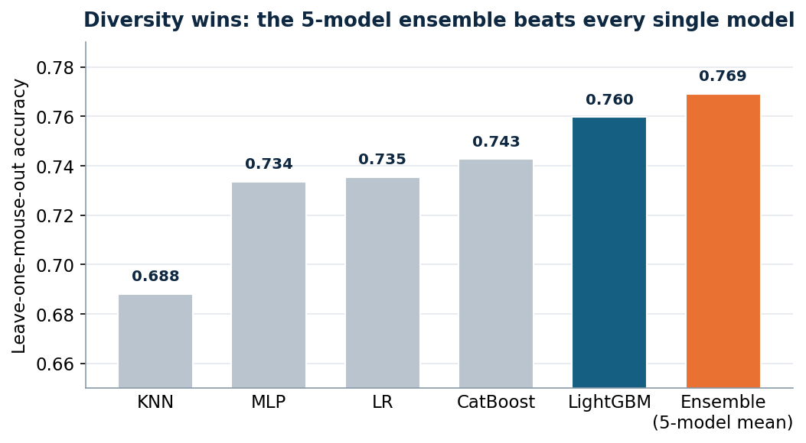
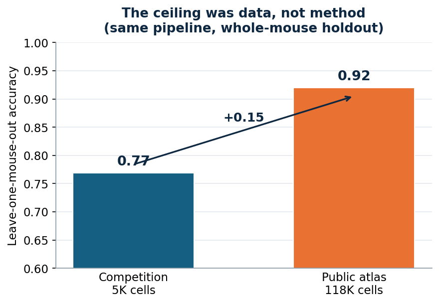

# MERFISH Spatial Transcriptomics — Cell-Type Annotation

**English | [中文](README.zh-CN.md)**

> Classifying 60 neuronal cell types from sparse spatial gene expression.
> **🥈 2nd Prize — University of Rochester Biomedical Data Science Hackathon, Summer 2026** (Team **XDRKAMOA**).

---

## 1. Background & result

The [University of Rochester Biomedical Data Science Hackathon, Summer 2026](https://github.com/Rochester-Biomedical-DS/Hackathon-Summer-2026)
was a prediction challenge on **MERFISH** spatial-transcriptomics data: classify the cell type
(1 of **60**) for each cell in a mouse spinal-cord dataset — ~10,000 cells, **200 genes**,
~**93% zeros** — scored by overall accuracy.

**Our team (XDRKAMOA) placed 🥈 2nd.** This repository is my modeling line for that entry: the
end-to-end pipeline, the validation that kept us honest, and a post-competition study of what
would push the model further.

---

## 2. Data exploration & key insights

Before modeling I ran a full EDA ([`eda/eda.py`](eda/eda.py) → [plain-English report](eda/EDA_REPORT_PLAIN_ENGLISH.md) · [technical report](eda/EDA_REPORT.md) · figures in [`eda/figures/`](eda/figures)) and wrote a [**data dictionary**](eda/DATA_DICTIONARY.md) documenting every column, its missingness, and how we'd use it. The findings shaped every decision below.

- **The data.** 10,000 cells (≈5K train / 5K test), 200 genes, 60 cell types. Expression is extremely sparse — the median cell has non-zero counts for only **12 of 200 genes** and **~21 transcripts total**, so each cell carries little information on its own.
- **★ E/I is a clean partition — our most useful insight.** Every one of the 60 types belongs to exactly one Excitatory/Inhibitory group: **24 excitatory · 15 inhibitory · 21 non-neuronal · zero overlap**. This directly motivated the hard-constraint decoder — a prediction should never cross the E/I line.
- **Missingness is informative.** E/I, Region and Segment are blank for ~60% of cells, but that blank marks non-neuronal cells — so we encode missingness explicitly instead of dropping it.
- **Severe class imbalance.** Largest class 703 training cells, smallest just 3 (~**234×**) — so we track per-class accuracy, not only the overall number.
- **Train and test are the same experiment.** Same 10 mice and 108 sections, spatially interleaved. A nearest-neighbor-only baseline scores only **11.1%** (vs. 14.1% for always-guess-majority) — location alone isn't enough, and a random split leaks neighbors between train and validation. **This is why we validate by holding out whole mice/batches, not random cells.**

---

## 3. Final model & results

**The model:** an **equal-probability ensemble of five diverse learners** — LightGBM · Logistic
Regression · MLP · KNN · CatBoost — wrapped by a **biology hard-constraint decoder** and
**fold-safe target encoding**, and deliberately **free of experiment-specific IDs**.

**Why we chose it:**
- **Diversity over a single tuned model** — five models with uncorrelated errors, averaged, are
  steadier than any one of them.
- **Biology should be enforced, not just learned** — a cell can't be an excitatory *and* an
  inhibitory type, so we forbid the model from ever crossing that line.
- **Honest generalization over leaderboard score** — we validated by holding out whole mice, and
  kept experiment IDs out of the features, because random cross-validation was misleading (below).

**Results** — leave-one-mouse-out accuracy (the honest, group-validated metric):

| Model | LOMO accuracy |
|---|---|
| KNN | 0.688 |
| MLP | 0.734 |
| Logistic Regression | 0.735 |
| CatBoost | 0.743 |
| LightGBM (baseline) | 0.760 |
| **5-model ensemble (final)** | **0.769** |

---

## 4. What improved the model most

Three factors did the real work:

- **Biology-constrained decoding.** EDA showed the *excitatory / inhibitory / non-neuronal* groups
  **never share a cell type**, so a hard mask forbids any prediction from crossing its E/I group —
  a whole class of errors removed for free.
- **Fold-safe target encoding.** Anatomical groups (Region, Segment, and their joint with E/I) are
  encoded into out-of-fold per-group cell-type priors — a "who lives here" signal the 200 sparse
  genes can't supply. This was our single most effective feature.
- **Generalization-first validation.** We validated with **leave-one-mouse-out** and
  **leave-one-batch-out** GroupKFold, and kept Mouse / Section / Dataset IDs out of the features.
  This mattered: an earlier version scored ~0.777 in random CV but ~0.75 online — a ~0.02 gap from
  random-CV optimism plus ID-like crutches. Removing the IDs and validating by group closed it.
  *(Rule of thumb we adopted: a change counts only if two seeds agree in sign.)*

---

## 5. How we built the model, step by step

1. **Baseline — LightGBM.** Strong and fast on tabular data; our starting point.
2. **Add a linear model — Logistic Regression.** With only 5K cells over 200 very sparse genes
   (~93% zeros), a linear model handles sparse, high-dimensional data well *and* fails differently
   from trees — the first source of diversity.
3. **Add three more diverse learners.** An **MLP** for non-linear structure, a **KNN** for
   neighborhood signal in expression space, and **CatBoost** — another tree, but one that behaves
   a little differently from LightGBM.
4. **Fuse by averaging probabilities.** Simple and robust. Compared to our best single model after
   feature engineering, the ensemble added about **a full point** of accuracy — purely from
   diversity, because the models make different mistakes that cancel out.



---

## 6. Directions worth exploring further

These ideas underperformed on 5K cells but are **validation-limited, not wrong** — real problems
in this field can be 10⁵–10⁶ cells. See [`reports/lessons_learned.md`](reports/lessons_learned.md).

- **Expression label features** (class-centroid cosine + expression-kNN vote) — noisy at 5K, stabilize with more reference cells.
- **Anatomical bucket constraint** (Region×E/I×Segment; 15 of 28 buckets map to one type) — a finer successor to the E/I mask once coverage fills in.
- **Deep & spatial models** (CNN/DNN, semi-supervised over full sections) — data-hungry; should overtake at scale.
- **LLM reranker (Qwen)** — unlike atlas-matching (CellTypist, GPTCelltype) or foundation models (scGPT, Geneformer) that need external references/corpora, a **no-external-data** experiment: the LLM acts only as a *decision-flow interceptor*, voting on our own uncertain top-3 under marker-gene gating. Research only, never submitted — [design & rules](experiments/llm_reranker/README.md).

**Evidence the ceiling is data, not method:** on a larger *public* atlas with whole-mouse holdout,
the same pipeline goes from ~0.77 to ~**0.92** as labeled cells grow 5K → 118K. A caution we
learned the hard way — **watch fold variance, not the mean**: an under-regularized model silently
collapsed whole held-out mice to 0.06 while random CV still read 0.9.
Code: [`experiments/atlas_loso_testbed.py`](experiments/atlas_loso_testbed.py).



---

## Integrity note

The competition banned external data, and **our submitted model uses none**. During the
competition I found that the public source atlas (Zenodo `MERFISH_spinal_cord_resolved_0718`)
**contains the competition's own cells**, making labels recoverable — a real leaderboard leak. We
**did not exploit it**, and this repo ships **no answer-key lookup code**. The atlas appears here
only as a *post-competition* scaling testbed with whole-mouse holdout, and the LLM component was
kept as **research only, never submitted** (a pretrained model's knowledge could itself count as
external information).

---

## Repository layout

```
eda/
  eda.py · EDA_REPORT*.md · DATA_DICTIONARY.md · figures/   # exploration, insights, data dictionary
src/
  model_v031_robust_5model.py          # final line: 5-model ensemble + E/I decoding + target encoding
  model_v04_full_centroid_knn_bucket.py# most complete pipeline (adds centroid/kNN/bucket features)*
  validation/                          # GroupKFold audits & ablations (the rigor)
experiments/
  atlas_loso_testbed.py                # post-competition data-scaling study (0.77 → 0.92)
  llm_reranker/                        # Qwen3 OOF reranker — research only, never submitted
reports/
  lessons_learned.md · figures/
```
\* v0.4 is the most complete pipeline but did **not** beat v0.31 on group CV, so v0.31 remained the
submission line — kept for transparency. See [`src/README.md`](src/README.md).

## Reproduce

```bash
pip install -r requirements.txt
# Data is NOT redistributed here — see data/README.md to obtain it, then:
python src/model_v031_robust_5model.py --mode oof   --schemes mouse dataset --seeds 0 1
python src/model_v031_robust_5model.py --mode predict --seeds 0 1 2 3 4
```

## Data

Not included (it belongs to the organizers / is a separately-licensed public dataset). See
[`data/README.md`](data/README.md).

## Team & my role

Team **XDRKAMOA** placed 2nd. As the team's **technical lead**, I built the **end-to-end pipeline —
from exploratory data analysis through modeling to final prediction** — working with three
first-time-competitor teammates from very different backgrounds, and set the validation strategy
that drove our modeling decisions.

## License

Code under the [MIT License](LICENSE). Data and the third-party atlas are **not** covered and are
not redistributed here.
