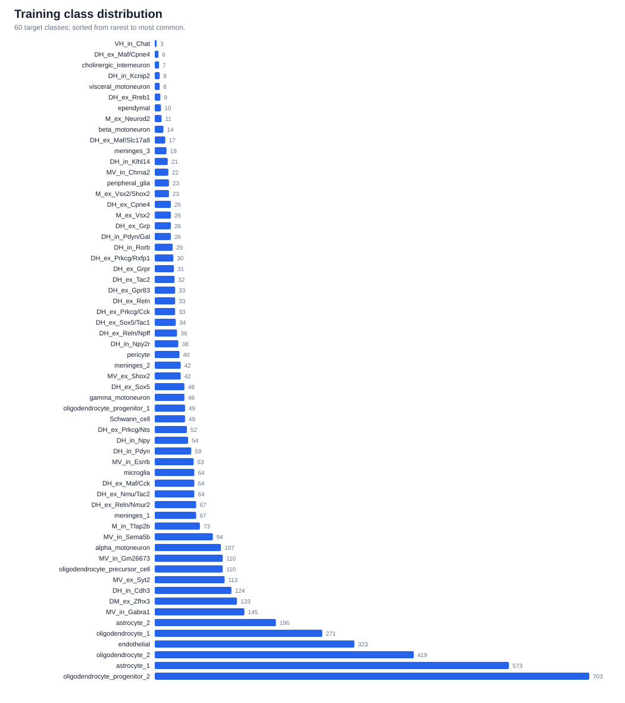
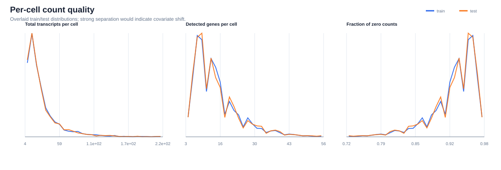
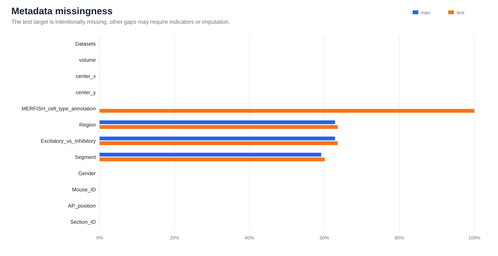
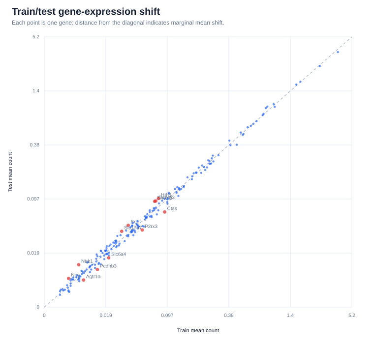
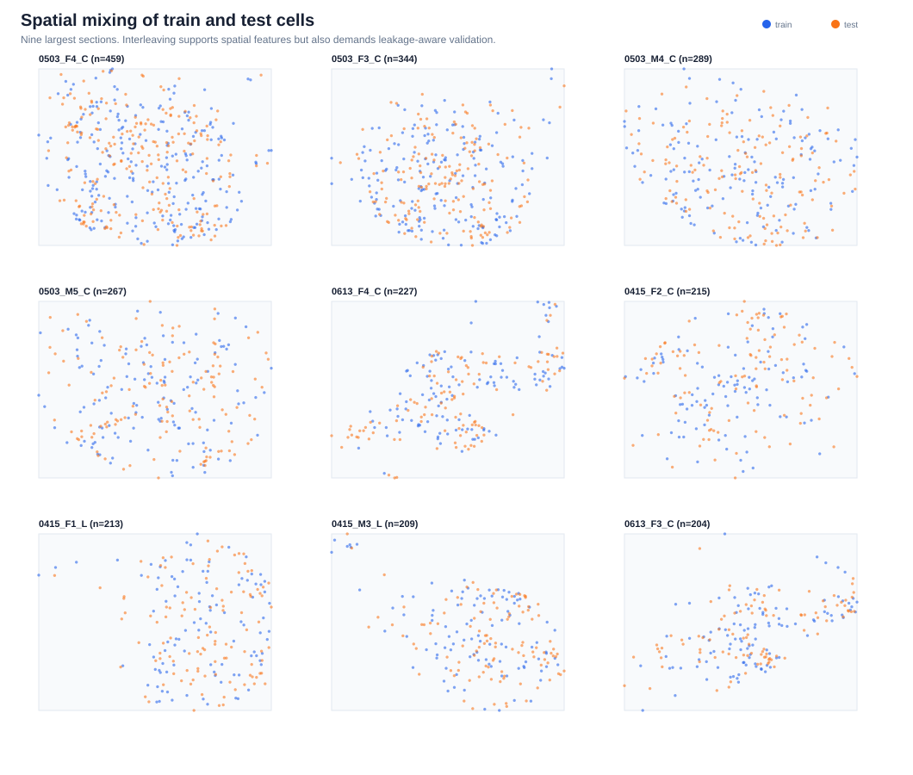
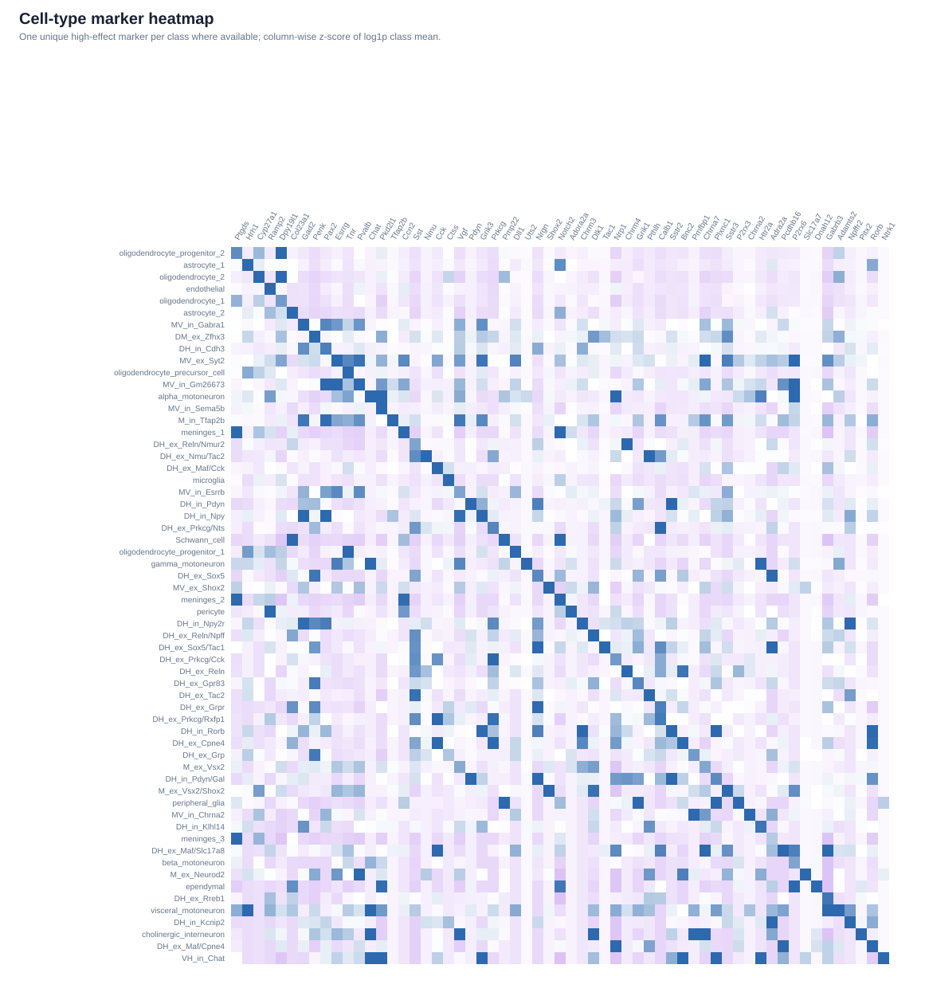

# MERFISH cell-type prediction — EDA

Generated by `eda/01_eda.py` from the four challenge CSV files.

## Executive summary

- The data contract is clean: train/test each contain **5,000 cells × 200 genes**; cell IDs are unique, counts are non-negative integers, gene order matches, and count matrices contain no missing values.
- There are **60 cell types**. The largest class has **703** cells and the smallest has **3** (imbalance ratio **234.3×**). A majority-class prediction would score only **14.1%** accuracy.
- Counts are sparse: the median cell has **12** detected genes in train and **12** in test, out of 200. Median total transcripts are **21** and **21**, respectively.
- Train and test share **108 sections** and **10 mice**. The median test cell is only **71.2 coordinate units** from a training cell in the same section (90th percentile **161.0**), so spatial context is likely predictive.
- A same-section spatial 1-nearest-neighbor rule evaluated leave-one-out on train reaches **11.1%**, versus **5.6%** expected agreement for two random labels with the observed class frequencies. It still trails the **14.1%** majority baseline, so location alone is insufficient.
- The largest categorical train/test shift is **Section_ID** (total-variation distance **0.078**). There are **2 exact count-vector duplicates** across train and test.

## Figures

### 1. Target balance



### 2. Count quality and sparsity



### 3. Missing metadata



### 4. Marginal gene shift



### 5. Train/test spatial mixing



### 6. Candidate markers



## Modeling implications

1. **Use two validation schemes.** Report stratified random cross-validation for an in-distribution estimate, and GroupKFold by `Section_ID` (or `Mouse_ID`) for a conservative generalization estimate. Random splitting alone will benefit from nearby cells and can overstate robustness.
2. **Start with count-aware preprocessing.** Compare raw/log1p counts, per-cell library-size normalization followed by log1p, and simple binary detection. With only 200 targeted genes, do not automatically discard low-detection genes; many are intentional markers.
3. **Build a strong tabular baseline first.** Multinomial logistic regression and tree boosting on expression + metadata will reveal whether nonlinear interactions matter. Treat `Datasets`, `Mouse_ID`, `Section_ID`, `Gender`, `AP_position`, `Region`, and `Segment` as categorical; add missing indicators.
4. **Add spatial features carefully.** Candidate features include within-section normalized x/y, distances to labeled neighbors, and neighborhood-aggregated expression. Every spatial feature must be recomputed inside each validation fold to prevent label leakage.
5. **Optimize the actual metric.** Accuracy rewards frequent classes, so compare ordinary training with class weighting rather than assuming weighting helps. Always inspect per-class recall and the confusion matrix even though the leaderboard uses overall accuracy.
6. **Use marker and drift tables for debugging.** Weak or biologically implausible markers can reveal label noise; strongly shifted genes or metadata levels can cause fragile validation gains.

## Output tables

- `tables/class_counts.csv`: class support.
- `tables/cell_qc.csv` and `cell_qc_summary.csv`: per-cell and aggregate count QC.
- `tables/metadata_missingness.csv`: train/test missingness.
- `tables/numeric_metadata_drift.csv` and `categorical_metadata_drift.csv`: train/test shift.
- `tables/gene_summary.csv`: gene abundance, detection, and marginal shift.
- `tables/top_markers_by_cell_type.csv`: five candidate markers per class.
- `tables/test_nearest_train_spatial_distance.csv`: spatial coverage of test by train.

## Reproduce

From the repository root:

```bash
python -m pip install -r eda/requirements.txt
python eda/01_eda.py
```
